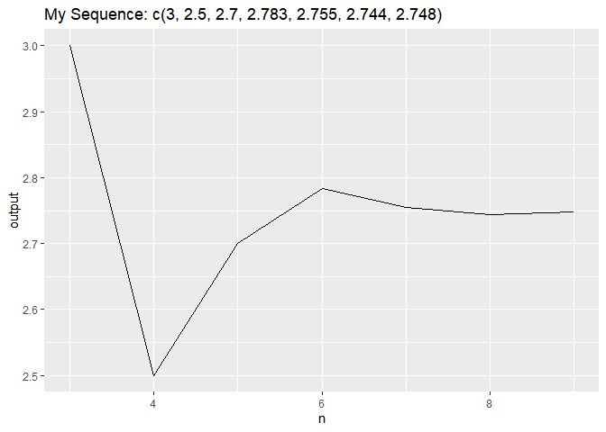

<!-- README.md is generated from README.Rmd. Please edit that file -->

# hw04pjenyuh

<!-- badges: start -->

<!-- badges: end -->

Author: Jen-Yu Huang

The goal of hw04pjenyuh is to create a function which return output of a
recursive sequence and plot the output to a line plot

## Installation

You can install the released version of hw04pjenyuh by asking me for a
copy

``` r
install.packages("hw04pjenyuh")
```

## Example

To run the package

``` r
library(hw04pjenyuh)
```

Find the fifth element of the recursive sequence generated by (2, 4, 3):

``` r
myseq_n(x = c(2, 4, 3), n = 5)
#> [1] 2.7
```

Plot the output of the sequence generated by (2, 4, 3) for n = 3 to 9:

    #> Warning: Use of `plot_df$n` is discouraged. Use `n` instead.
    #> Warning: Use of `plot_df$output` is discouraged. Use `output` instead.


